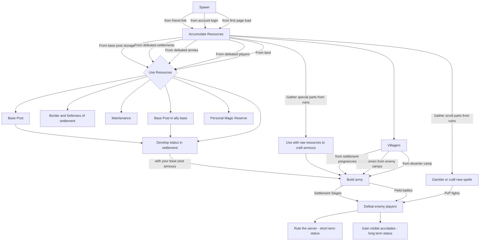

# Swords & Meadows: Online - Design Document

## Design Goals
### Primal Inclinations for Reference
- Hunting
- Gathering
- Exploring
- Crafting tools from raw materials
- Expansionism -> economics of never ending wants
- Building social status
- Escape the predator
- Defeating enemies
- Mastery

### Socialized inclinations
- Leaving a legacy

### Technical considerations
- Low overhead when networked

## High Concept

You are a mage. Your goal is to rule or develop influence over the server and other players. Gather magic, craft new spells, master combat sorcery system. Create a village, build status, raise an army, become a renowned general. Develop alliances with other players, take up residence in towns as a battle mage for the people, develop status among your kings kingdom and ride with them to the top.

## Gameplay Mechanics

### Victory Conditions

Rule over the player base.

### First Minutes after Menus

Menu item in top right with "tutorial"

### Game Flow

Magic is the combat metric for mage to mage fighting
Troops + Weapons and Armour is the metric for town against town fighting

Player has to define border to allow village to develop

Procedural generation simply outlines where regions and resource points will be located, these resources are activated depending on distance from origin and average peak players per week, less players more scarce the resources past the origin

Solve inequality by making the time cost vs maintenance peak at a certain hour count (14??), fast early reward, diminishing returns. If not maintained village crumbles at exponentially slower rate until everyone dies or deserts. Playtime rewarded with visual indicators of experience rather than material wealth. True power can only be solved via large networked groups of players, larger networks of players naturally increase the economy by expanding resource access farther from origin. Makes those far from origin gain temporary benefits, reduces power of group via inflation, gives room for players to avoid the monopolies oppression

Add "travel cost" to armies. Allowing for multiple monopolies on one server.

An army is like one customizable weapon with different properties. We can perhaps send render calculations... or not
One army unit has properties (speed, strength, food consumption, position, composition, current command, engaged army)
Players cannot directly interact with enemy armies. Armies only interact with other armies and settlements. They are like a background simulation
Killing players route the enemy army after a few seconds. Players who run away have their armies follow at certain distance
WHen a player engages an enemy army it needs to be a certain distance from a friendly army to before it actually starts dealing damage, therefore preventing back stacked armies dealing ghost damage to an army several meters away.

Secret sauce for unlimited multiplayer

- Load balancer
- Scalable node process number
- Intermediary redis db
- Parallel process that 1. Understand player network speed, 2. Decides how many entities to network, 3. Runs a calculation every 2-seconds for which state that particular player needs updating (distance based) and will notify the node process to only detect and return changes to state from those entities
- Sort passive entities (wall/tower health) w\ active entities (players, armies) 

Defensive spells are more abundant and a 3rd cheaper than offensive spells. Players equip new spells at the node of mouse click combinations. UI IDEA -> mouse pic with sides lighting up every time node is selected.
