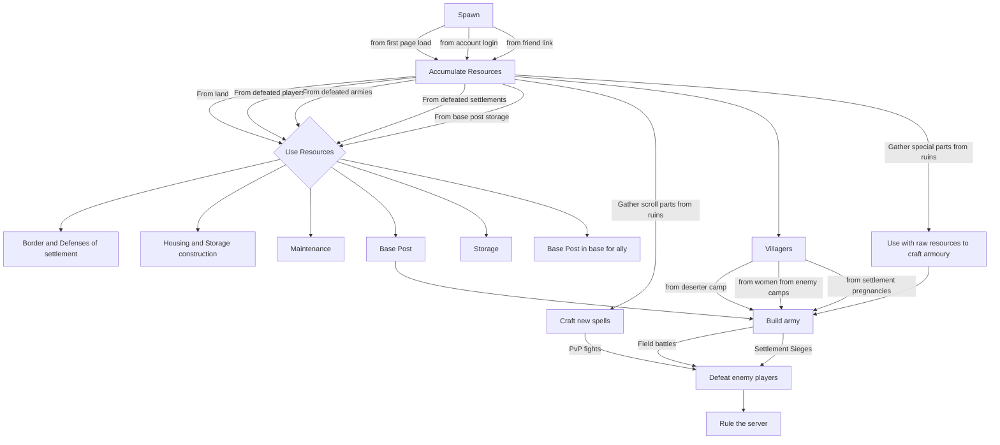

# Swords & Meadows: Online - Design Document

## Design Goals
### Primal Inclinations for Reference
- Hunting
- Gathering
- Exploring
- Crafting tools from raw materials
- Expansionism -> economics of never ending wants
- Building social status
- Escape the predator
- Defeating enemies
- Mastery

### Socialized inclinations
- Leaving a legacy

### Technical considerations
- Low overhead when networked

## High Concept

You are a mage. Your goal is to rule or develop influence over the server and other players. Gather magic, craft new spells, master combat sorcery system. Create a village, build status, raise an army, become a renowned general. Develop alliances with other players, take up residence in towns as a battle mage for the people, develop status among your kings kingdom and ride with them to the top.

## Gameplay Mechanics

### Victory Conditions

Rule over the player base.

### First Minutes after Menus

Menu item in top right with "tutorial"

### Game Flow

### Spawn

- Upon spawn you are granted full health and a token amount of magic
- If using friend link use graph to find nearest adjacent free position to spawn player
- Player entity will remain in place and grey out when signed out. Can be killed and have items stolen

### Resources

|Resource|Location|Purpose|
|---|---|---|
|Magic|Ruin monument reserves|Combat|
|Wood|Trees|Tier One Walls, Tier One Towers, Early Armoury Items, Structure Maintenance|
|Stone|Shattered Cliffs|Tier Two Walls, Tier Two Towers, Structure Maintenance|
|Metal Ore|Ore nodes|Tier Two Walls, Tier Two Towers, Structure Maintenance, Mid Armoury Items|
|Rare Ore|Ore nodes (Random), Ruins (Chest)|Strong Armoury Items|
|Berries (Food variant)|Berry Bushes|Villager Maintenance|
|Wheat (Food variant)|Wheat plants|Villager Maintenance|
|Meat (Food variant)|Idle Deer|Villager Maintenance|
|Leather|Idle Deer|Early Armour|
|Bind|Ruins (Chest)|Early, Mid, Late weapons|
|Glade Handle (Short sword)|Ruins (Chest)|Light Early, Weak mid Swords [Lighter, lower damage]|
|Fibre Wood Handle (Short sword)|Ruins (Chest)|Light Early, Mid, Late (weak) Swords [Lighter, lower damage]|
|Feather Metal Handle (Short sword)|Ruins (Chest)|Mid, Late Swords [Lighter, lower damage]|
|Oak Handle (Long sword)|Ruins (Chest)|Early, Weak mid swords [Heavy, high damage]|
|Iron Handle (Long sword)|Ruins (Chest)|Mid, weak late swords [Heavy, high damage]|
|Dense Spine Handle (Long sword)|Ruins (Chest)|Mid, late swords [Heavy, high damage]|
|Leather Boss|Ruins (Chest)|Early, weak Mid Shields [Normal, Light Protection]|
|Metal Boss|Ruins (Chest)|Mid, weak late Shields [Normal, Medium Protection]|
|Dense Metal Boss|Ruins (Chest)|Mid, late Shields [Normal/Heavy, Strong Protection]|
|Neutral Scroll Parchment|Ruins (Chest)|Use for spell book crafting|
|Electric Scroll Parchment|Ruins (Chest)|Use for spell book crafting (bonus progress for electric)|
|Fire Scroll Parchment|Ruins (Chest)|Use for spell book crafting (bonus progress for fire)|
|Force Scroll Parchment|Ruins (Chest)|Use for spell book crafting (bonus progress for force)|
|Electric variant spell book|Crafting, Ruins (Chest)|Equip for battle|
|Fire variant spell book|Crafting, Ruins (Chest)|Equip for battle|
|Force variant spell book|Crafting, Ruins (Chest)|Equip for battle|
|Villager (Male)|Destroyed Armies, sieged settlements, deserter camps|Fund armies|
|Villager (Women)|Sieged settlements, deserter camps|Makes Babies|

### Resource Sources
#### Ruins

Ruins will have "specialties" in terms of spell types and weapon part spawn chance (e.g. (force, heavy) or (fire, light)). These can be reflected in the ruin monument statues.

Defense spell book spawns are more common than offensive spell book spawns

### Crafting & Construction

#### Spell Books

Tree of spells of the three elements, advanced defense spells should be readily available on different branches closer to base. Scroll parchment of differing spells types provide more currency value for crafting spells of that element. More advanced spells books cost more parchment currency and require more magic to use in battle.

|Item (Spell book)|Recipe|
|---|---|
|Basic Fire Defense|-|
|Medium Fire Defense|-|
|Strong Fire Defense|-|
|Basic Direct Fire Attack|-|
|Strong Direct Fire Attack|-|
|Basic Direct+Radius Fire Attack|-|
|Strong Direct+Radius Fire Attack|-|
|Basic Radius Fire Attack|-|
|Strong Radius Fire Attack|-|
|Basic Electric Defense|-|
|Medium Electric Defense|-|
|Strong Electric Defense|-|
|Basic Direct Electric Attack|-|
|Strong Direct Electric Attack|-|
|Basic Direct+Radius Electric Attack|-|
|Strong Direct+Radius Electric Attack|-|
|Basic Radius Electric Attack|-|
|Strong Radius Electric Attack|-|
|Basic Force Defense|-|
|Medium Force Defense|-|
|Strong Force Defense|-|
|Basic Direct Force Attack|-|
|Strong Direct Force Attack|-|
|Basic Direct+Radius Force Attack|-|
|Strong Direct+Radius Force Attack|-|
|Basic Radius Force Attack|-|
|Strong Radius Force Attack|-|

#### Weapons

|Item|Recipe|
|---|---|
|Ancestor Spear|Wood + Metal|
|Steel Reed Spear|Oak Handle + Wood + Rare metal + Bind|
|Glade Short Sword|Glade Handle + Metal + Bind|
|Glade Sword|Glade Handle + Metal + Bind|
|Katana|Fibre Wood Handle + Metal + Bind|
|Fine Katana|Fibre Wood Handle + Rare metal + Bind|
|Laido Sword|Feather Metal Handle + Metal + Bind|
|Masterwork Laido Sword|Feather Metal Handle + Rare metal + Bind|
|Oak Sword|Oak Handle + Metal + Bind|
|Oak Long Sword|Oak Handle + Metal + Bind|
|Gladius|Iron Handle + Metal + Bind|
|Fine Gladius|Iron Handle + Rare metal + Bind|
|Broadsword|Dense Spine Handle + Metal + Bind|
|Weighted Broadsword|Dense Spine Handle + Rare metal + Bind|

#### Shields

|Item|Recipe|
|---|---|
|Weaved Shield|Wood|
|Wooden Round Shield|Thicc Leather Boss + Wood + Bind|
|Decorated Round Shield|Leather Boss + Wood + Metal + Bind|
|Reinforced Shield|Metal Boss + Metal + Bind|
|Knox Shield|Dense Metal Boss + Rare Metal + Bind|

#### Armour

|Item|Recipe|
|---|---|
|Leather Armour|Leather|
|Decorated Leather Armour|Leather + Metal|
|Metal Armour|Metal + Bind|
|Plate Armour|Rare metal + metal + bind|

#### Walls

|Construction|Recipe|
|---|---|
|Wooden Palisade|Wood|
|Wooden Gate|Wood|
|Stone Wall|Stone|
|Stone Gate|Stone + Wood|
|Metal Wall|Metal|
|Metal Gate|Metal|

#### Towers

|Construction|Recipe|
|---|---|
|Watch Tower|Wood|
|Reinforced Watch Tower|Wood + Metal|
|Outpost|Metal|
|Tower|Metal + Rare metal|

#### Platform

Wood + Metal

#### Buildings

|Construction|Recipe|
|---|---|
|Base Post|Wood + Metal|
|House|Wood|
|Storage|Wood + Metal|

### Storage

Resources and villagers can be deposited in base post to be automatically proliferated through storages and houses, or they can be directly stored in select buildings. Access to storage can be done through base posts which will be sorted. Only base owners and teammates can access storage (prevent placing storage across the map for trading, requires invading army to destroy buildings).

Storage capacity deficit for resources and villagers will result in decay and desertion

### Armies

One player can summon up to 3 army units. Each army unit has a banner bearer. This banner bearer "protects" the unit from enemy players from a lore perspective. The banner bearer acts as the aggregate position of the army and the point which the enemy player can cause damage to the army as a whole. The banner bearer is where aggregate info regarding the army can be found.

Add "travel cost" to armies. Allowing for multiple monopolies on one server.

An army is like one customizable weapon with different properties. We can perhaps send render calculations... or not
One army unit has properties (speed, strength, food consumption, position, composition, current command, engaged army)

WHen a player engages an enemy army it needs to be a certain distance from a friendly army to before it actually starts dealing damage, therefore preventing back stacked armies dealing ghost damage to an army several meters away.

Players can damage enemy armies (banner bearers) at great magic cost

Army will have player name

Armies will automatically attack other armies that attack it. The player will need to manually target an army unit with another army unit

`1, 2, 3` to select army unit `F1: Go to place, F2: Follow me, F3: Attack` If no army unit is selected then all armies assume command

### World

Some terrain sprites allow player entities to be completely hidden (Name, health, etc) allowing for ambush and evasion opportunities

Procedural generation simply outlines where regions and resource points will be located, these resources are activated depending on distance from origin and average peak players per week, less players more scarce the resources past the origin

The world will initially be generic. Ruins of different types will create demand for certain regions

### Settlements

The 3 craftable parts of a settlement include the walls, towers and player platforms that allow for players to shoot over adjacent walls. Walls are sections "3 units thick" and are the target for a single army unit or player mage attack.

Houses are crafted to store villagers, storage to store everything else.

Base posts have an construction range of +-150 units. Nothing can be built in this range or within the range of 20 units from a building in this zone

### Sieges

A player can theoretically attack a settlement by themselves but at a massive magic cost. They would need to spend magic defending against towers and assaulting the relevant structures (Walls, annoying towers, player base posts). The benefits of an army is that they have infinite assault capabilities while a mage needs to put themselves at risk by harnessing massive magic ability.

When players are offline all male villagers with cap on women (25% of women) will barricade themselves across the base posts in a 100|70,30|60,20,10| Ratio with full equipment and act as stationary armies with the building health acting as a health increase for that army

Buildings can be destroyed to steal women

### Spells

More advanced spells use more magic. There are 3 magic elements with unique advantages

Fire - Bonus against armies (banner holders) (10 - 25%)
Electric - Bonus against players (10 - 25%)
Force - Bonus against structures (10 - 25%)

Defense against the different types of magic can be used by any element but become more ineffective if the defense spell is weaker or of another element

Direct attacks deal more damage than direct + radius and radius spells

Defense spells can last for a period of time, allowing the player to defend then pop off a collection of attacks

### Equipping Spell Books

Players equip new spells at the node of mouse click combinations. UI IDEA -> mouse pic with sides lighting up every time node is selected.

### Health

- All mages will have fixed health, health will naturally regenerate after a certain duration from last damage
- No maintenance resources degrades building health until 0
- If maintenance resources exist structures heal overtime
  - Player can instantly heal structures for a price

### UI

- XY coord indicator
- "Get shareable link"
- (Sign in | Claim this account) / Sign out

### Inequality Problem

Solve inequality by making the time cost vs maintenance peak at a certain hour count (14??), fast early reward, diminishing returns. If not maintained village crumbles at exponentially slower rate until everyone dies or deserts. Playtime rewarded with visual indicators of experience rather than material wealth. True power can only be solved via large networked groups of players, larger networks of players naturally increase the economy by expanding resource access farther from origin. Makes those far from origin gain temporary benefits, reduces power of group via inflation, gives room for players to avoid the monopolies oppression

### Unlimited Multiplayer

Secret sauce for unlimited multiplayer

- Load balancer
- Scalable node process number
- Intermediary redis db
- Parallel process that 1. Understand player network speed, 2. Decides how many entities to network, 3. Runs a calculation every 2-seconds for which state that particular player needs updating (distance based) and will notify the node process to only detect and return changes to state from those entities
- Sort passive entities (wall/tower health) w\ active entities (players, armies) 

### Road Map ideas

- Armour enhancements
- Player constructions to automate generation of some resources (magic)
- Make player need to complete resource or chest gathering mini games
- Cloak and staff crafting
- Accolade system that shows experience or playtime
- In game chat system
